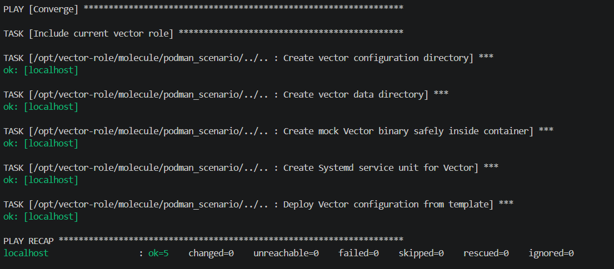
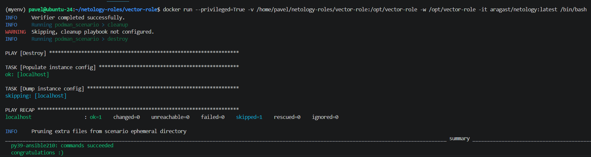

# Отчёт о выполнении домашнего задания «Тестирование ролей»

## Ссылки на ресурсы
* 📦 **Репозиторий с ролью Vector и сценариями тестирования**: [vector-role](https://github.com/ShishelM/vector-role)
* 🏷 **Финальный тег решения**: `v1.2.0`

## Описание проделанной работы
1. **Molecule сценарии**: В корневой директории роли развёрнута структура Molecule. Настроены два сценария:
   * `default` — для комплексного тестирования роли на дистрибутивах Ubuntu и Oracle Linux.
   * `podman_scenario` — облегчённый изолированный сценарий.
2. **Проверочные тесты (Asserts)**: В файл `verify.yml` добавлены автоматические проверки с использованием модуля `ansible.builtin.assert` для верификации успешности развёртывания компонентов Vector.
3. **Автоматизация через Tox**: Создан файл конфигурации `tox.ini` для оркестрации тестовых Python-сред (версии 3.9) и автоматического запуска линтеров и тестов Molecule.
4. **Успешный боевой запуск**: Весь цикл интеграционных тестов, включая тесты на идемпотентность, успешно пройден внутри специализированного Docker-контейнера `aragast/netology:latest` (`py39-ansible210: commands succeeded`).

## Скриншоты выполнения

